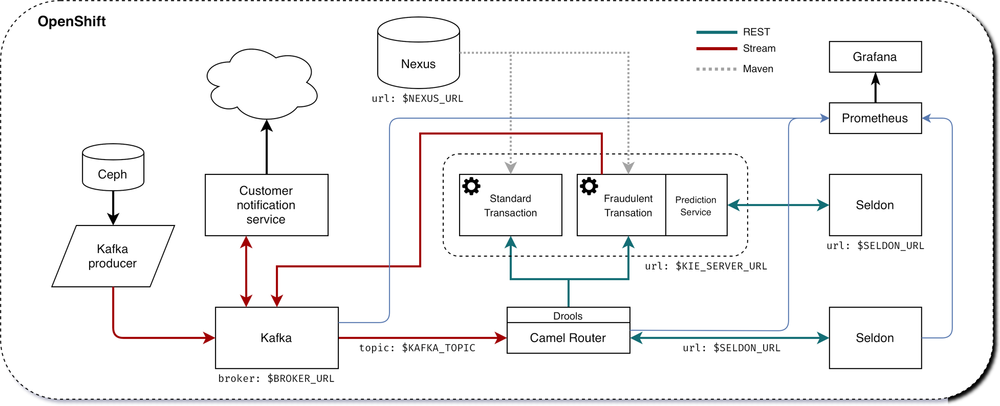

= Fraud Detection with Business Workflows Tutorial
:toc: macro

toc::[]

== Setup

=== OpenShift

Some steps of this tutorial are made through the OpenShift UI, some others through the oc command. So you should be logged in the two of thems.

First we'll need a project for this demo. We will use ccfd (Credit Card Fraud Detection). You can create it through the UI, or with this command:

[source,bash]
----
oc new-project ccfd
----

=== Open Data Hub

==== Operator

The Open Data Hub (ODH) operator can be deployed through the steps described https://opendatahub.io/docs/getting-started/quick-installation.html[here].

==== Deploy ODH

Now that the operator is running, we can deploy our instance of ODH in our `ccfd` project. This deployment will include:

- Kafka
- Seldon
- Prometheus
- Grafana

WARNING: As an option, the Open Data Hub (ODH) operator can deploy the Strimzi operator that will handle the deployment of the Kafka cluster. However, if Strimzi or AMQ Streams are already present on your cluster, deploying it again may create issues. Therefore, 2 different versions of the ODH deployment are provided, with or without the Strimzi operator deployment. Choose according to your configuration.

.If you need to deploy the Strimzi operator
[source,bash]
----
oc apply -n ccfd -f deploy/odh/odh-with-strimzi.yaml
----

.If you don't need to deploy the Strimzi operator (you already have it or AMQ Streams)
[source,bash]
----
oc apply -n ccfd -f deploy/odh/odh-no-strimzi.yaml
----

=== Rook-Ceph / OCS

TBW

=== Fraud detection model

Deploy fraud detection fully trained model by using `deploy/model/modelfull.yaml` in this repository:

[source,bash]
----
oc apply -n ccfd -f deploy/model/modelfull.yaml
----

Check and make sure the model is created, this step will take a couple of minutes.

[source,bash]
----
oc -n ccfd get seldondeployments
oc -n ccfd get pods
----

You should have a pod named `modelfull-modelfull-0-modelfull-xxxxxxxxx` with the Running status.

Create a route to the model by using `deploy/model/modelfull-route.yaml` in this repo:

[source,bash]
----
oc apply -n ccfd -f deploy/model/modelfull-route.yaml
----

=== Upload data to Rook-Ceph/OCS

Create a bucket through an Object Bucket Claim. Depending if you are using Rook-Ceph or OCS, you can use different configurations.

.With Rook-Ceph
[source,bash]
----
oc apply -n ccfd -f deploy/storage/obc-rook.yaml
----

.With OCS, using MCG
[source,bash]
----
oc apply -n ccfd -f deploy/storage/obc-ocs-mcg.yaml
----

.With OCS, using RGW
[source,bash]
----
oc apply -n ccfd -f deploy/storage/obc-ocs-rgw.yaml
----

Retrieve the informations needed to connect to the storage.

==== With Rook-Ceph

==== With OCS

You can find the information through the OCP console, in the "Storage->Object Bucket Claims" section (selecting ccdata and clicking on "Reveal values"), or do this through the CLI:

.Access Key
[source,bash]
----
oc get secret/ccdata -o yaml | grep [^:]AWS_ACCESS_KEY_ID | awk '{print $2}' | base64 -d - 
----

.Secret Key
[source,bash]
----
oc get secret/ccdata -o yaml | grep [^:]AWS_SECRET_ACCESS_KEY | awk '{print $2}' | base64 -d - 
----

.Bucket name
[source,bash]
----
oc get cm/ccdata -o yaml | grep [^:]BUCKET_NAME | awk '{print $2}'
----

.Host (Internal access)
[source,bash]
----
oc get cm/ccdata -o yaml | grep [^:]BUCKET_HOST | awk '{print $2}'
----

.Host (External access)
[source,bash]
----
oc get -n openshift-storage route/s3 -o yaml | grep -m 1 '[^\-] host:' | awk '{print $2}'
----

